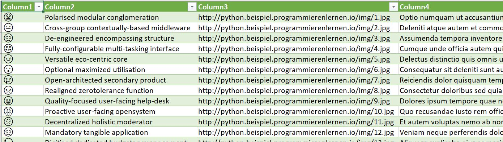
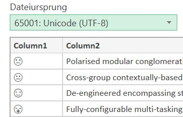

# crawlerpython

A simple crawler (no machine learning) to crawl a specific page. 
The code is from the Training [Python Bootcamp](https://www.udemy.com/course/python-bootcamp/) on Udemy from Jannis Seemann.

The url crawled is an [example page](http://python.beispiel.programmierenlernen.io/index.php) and the kex information from this page will be read, the top 8 articles will be presented and all articles will be stored in a seperate Document (readable for Excel).


## Visuals

- Structure of the Data:  
  
- When importing the Data to Excel, be sure to choose Unicode (UTF-8):
  


## Installation

If you are using PyCharm you need to install following libaries (in Anaconda they are already pre-installed):
- [Requests](https://docs.python-requests.org/en/master/) - is an elegant and simple HTTP library for Python, built for human beings.
```bash
import requests
```
- [Beautiful Soup](https://www.crummy.com/software/BeautifulSoup/bs4/doc/) - for pulling data out of HTML and XML files
```bash
from bs4 import BeautifulSoup
```

- [urljoin](https://docs.python.org/3/library/urllib.parse.html) - convert a “relative URL” to an absolute URL given a “base URL.”
```bash
from urllib.parse import urljoin
```
- [time](https://docs.python.org/3/library/time.html) - This module provides various time-related functions
```bash
import time
```

- [csv](https://docs.python.org/3/library/csv.html#csv.writer) — CSV File Reading and Writing
```bash
import csv
```

- Be sure to also copy the folder **crawler** which includes the used function "ArticleFetcher" and "CrawledArticle".
```bash
from crawler import ArticleFetcher
```

## Contributing
This is the code from the training of Jannis Seemann. For more information or to also conduct the training visit [Udemy course](https://www.udemy.com/course/python-bootcamp/)

## License
[MIT](https://choosealicense.com/licenses/mit/)
